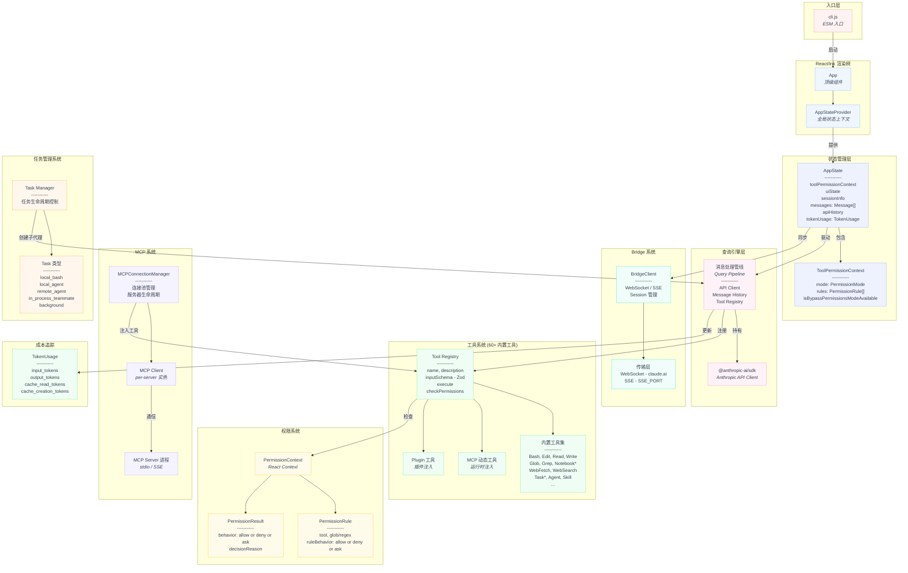
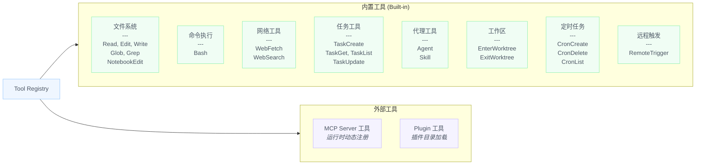
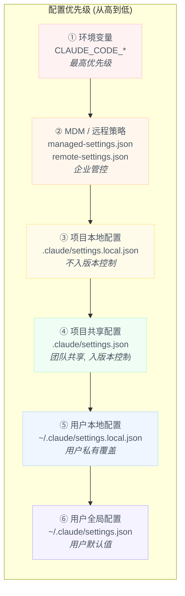
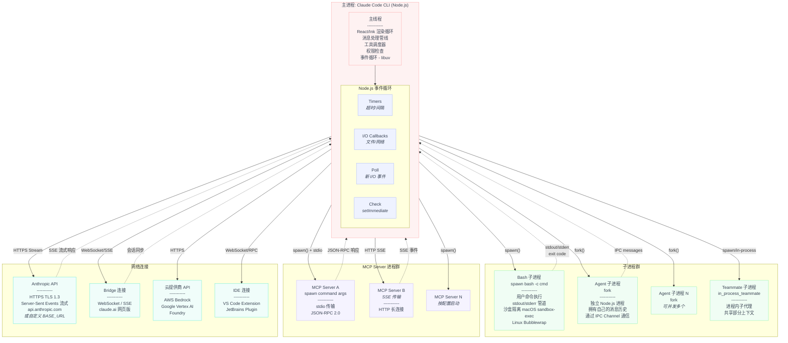
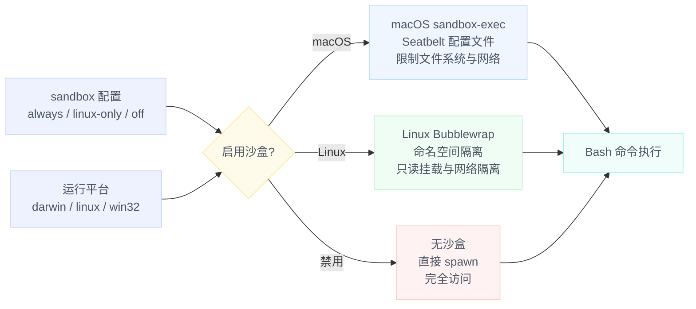
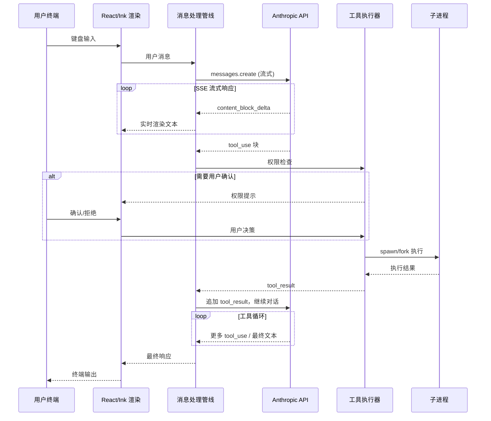

# 阶段 2：整体架构分析

> 本文对 Claude Code CLI（`@anthropic-ai/claude-code` v2.1.x）的运行时对象关系、配置体系与进线程拓扑进行全面剖析。


## 1. 运行时对象图

Claude Code 采用 **React/Ink 终端 UI + 单进程事件循环** 架构。下图展示核心运行时对象之间的持有（组合）、引用（聚合）与依赖关系。

### 1.1 全局对象关系总览



### 1.2 对象关系说明

| 对象 | 职责 | 生命周期 |
|------|------|----------|
| `App` | React/Ink 顶级组件，挂载所有 Provider | 进程生命周期 |
| `AppStateProvider` | 通过 React Context 向下传递全局状态 | 同 `App` |
| `AppState` | 全局可变状态容器：消息历史、权限上下文、UI 状态、会话信息、Token 用量 | 同 `App` |
| `ToolPermissionContext` | 权限模式与规则集合，嵌入于 `AppState` | 同 `AppState` |
| Query Pipeline | 消息处理管线：接收用户输入 → 组装请求 → 调用 API → 解析流式响应 → 调度工具执行 | 每轮对话 |
| `@anthropic-ai/sdk` | 官方 Anthropic SDK，负责 HTTP 通信与流式解析 | 同 Query Pipeline |
| Tool Registry | 工具注册中心，维护 60+ 内置工具 + MCP 动态工具 + Plugin 工具 | 进程生命周期 |
| `PermissionContext` | React Context，向工具系统提供权限检查能力 | 同 `App` |
| `BridgeClient` | 与 claude.ai 网页端双向通信的客户端 | 按需创建/销毁 |
| `MCPConnectionManager` | 管理所有 MCP Server 连接的生命周期和工具注入 | 进程生命周期 |
| Task Manager | 管理子任务（子代理、后台任务等）的创建与生命周期 | 进程生命周期 |
| `TokenUsage` | 跟踪各维度 Token 消耗（输入/输出/缓存读取/缓存创建） | 累积统计 |

### 1.3 工具系统细分



每个工具对象遵循统一接口：

```typescript
interface Tool {
  name: string;                    // 工具唯一标识
  description: string;             // LLM 可见的描述文本
  inputSchema: ZodSchema;          // Zod 模式验证输入
  execute(input, context): Promise<ToolResult>;    // 执行逻辑
  checkPermissions(input, context): Promise<PermissionResult>;  // 权限预检
  requiresUserInteraction?(): boolean;  // 是否需要用户交互
}
```


## 2. 配置矩阵

Claude Code 拥有一套多层级、多来源的配置合并体系。配置按优先级从高到低逐层叠加，高优先级覆盖低优先级的同名字段。

### 2.1 配置文件加载顺序



| 优先级 | 配置来源 | 路径 | 用途 |
|--------|----------|------|------|
| 1 (最高) | 环境变量 | `CLAUDE_CODE_*` | 运行时覆盖一切配置 |
| 2 | MDM 策略 | `managed-settings.json` / `remote-settings.json` | 企业级集中管控 |
| 3 | 项目本地 | `.claude/settings.local.json` | 开发者个人对当前项目的配置（不提交 Git） |
| 4 | 项目共享 | `.claude/settings.json` | 团队约定的项目级配置（提交 Git） |
| 5 | 用户本地 | `~/.claude/settings.local.json` | 用户私有覆盖 |
| 6 (最低) | 用户全局 | `~/.claude/settings.json` | 用户级默认设置 |

此外，CLI 的 `--settings <file-or-json>` 参数和 `--setting-sources` 参数可进一步控制加载行为。

### 2.2 关键配置字段

```json
{
  "sandbox": "linux-only | always | off",
  "toolPermissionMode": "default | acceptEdits | bypassPermissions | plan | dontAsk | auto",
  "hooks": {
    "PreToolUse": [...],
    "PostToolUse": [...],
    "Notification": [...],
    "Stop": [...],
    "SessionEnd": [...]
  },
  "plugins": ["plugin-name-or-path"],
  "memory": {
    "enabled": true
  },
  "effort": "low | medium | high | max",
  "allowedTools": ["Bash(git:*)", "Edit", "Read"],
  "disallowedTools": ["WebFetch"],
  "mcpServers": {
    "server-name": {
      "command": "npx",
      "args": ["-y", "@modelcontextprotocol/server-xxx"],
      "env": {}
    }
  }
}
```

### 2.3 环境变量矩阵

Claude Code 识别 **200+ 环境变量**，按功能域分组如下：

#### 2.3.1 核心认证与 API

| 环境变量 | 说明 |
|----------|------|
| `ANTHROPIC_API_KEY` | Anthropic 直连 API 密钥 |
| `ANTHROPIC_AUTH_TOKEN` | 认证令牌 |
| `ANTHROPIC_BASE_URL` | API 基础 URL（自定义端点） |
| `ANTHROPIC_MODEL` | 全局模型覆盖 |
| `ANTHROPIC_SMALL_FAST_MODEL` | 轻量模型覆盖（子代理等场景） |
| `ANTHROPIC_LOG` | SDK 日志级别 |
| `ANTHROPIC_BETAS` | Beta 功能标头 |
| `ANTHROPIC_CUSTOM_HEADERS` | 自定义 HTTP 请求头 |
| `ANTHROPIC_UNIX_SOCKET` | Unix Socket 连接 |

#### 2.3.2 多云提供商

| 环境变量 | 说明 |
|----------|------|
| `ANTHROPIC_BEDROCK_BASE_URL` | AWS Bedrock 端点 |
| `ANTHROPIC_FOUNDRY_BASE_URL` | Foundry 端点 |
| `ANTHROPIC_FOUNDRY_API_KEY` | Foundry API 密钥 |
| `ANTHROPIC_FOUNDRY_AUTH_TOKEN` | Foundry 认证令牌 |
| `ANTHROPIC_FOUNDRY_RESOURCE` | Foundry 资源标识 |
| `ANTHROPIC_SMALL_FAST_MODEL_AWS_REGION` | Bedrock 轻量模型 AWS 区域 |
| `CLAUDE_CODE_USE_BEDROCK` | 启用 AWS Bedrock |
| `CLAUDE_CODE_USE_VERTEX` | 启用 Google Vertex AI |
| `CLAUDE_CODE_USE_FOUNDRY` | 启用 Foundry |
| `CLAUDE_CODE_SKIP_BEDROCK_AUTH` | 跳过 Bedrock 认证 |
| `CLAUDE_CODE_SKIP_VERTEX_AUTH` | 跳过 Vertex 认证 |
| `CLAUDE_CODE_SKIP_FOUNDRY_AUTH` | 跳过 Foundry 认证 |

#### 2.3.3 模型配置

| 环境变量 | 说明 |
|----------|------|
| `ANTHROPIC_DEFAULT_SONNET_MODEL` | 默认 Sonnet 模型 ID |
| `ANTHROPIC_DEFAULT_SONNET_MODEL_NAME` | Sonnet 显示名 |
| `ANTHROPIC_DEFAULT_SONNET_MODEL_DESCRIPTION` | Sonnet 描述 |
| `ANTHROPIC_DEFAULT_SONNET_MODEL_SUPPORTED_CAPABILITIES` | Sonnet 能力声明 |
| `ANTHROPIC_DEFAULT_OPUS_MODEL` | 默认 Opus 模型 ID |
| `ANTHROPIC_DEFAULT_OPUS_MODEL_NAME` / `_DESCRIPTION` / `_SUPPORTED_CAPABILITIES` | Opus 模型配置 |
| `ANTHROPIC_DEFAULT_HAIKU_MODEL` | 默认 Haiku 模型 ID |
| `ANTHROPIC_DEFAULT_HAIKU_MODEL_NAME` / `_DESCRIPTION` / `_SUPPORTED_CAPABILITIES` | Haiku 模型配置 |
| `ANTHROPIC_CUSTOM_MODEL_OPTION` | 自定义模型 ID |
| `ANTHROPIC_CUSTOM_MODEL_OPTION_NAME` / `_DESCRIPTION` | 自定义模型配置 |
| `CLAUDE_CODE_SUBAGENT_MODEL` | 子代理专用模型 |

#### 2.3.4 OAuth 与账户

| 环境变量 | 说明 |
|----------|------|
| `CLAUDE_CODE_OAUTH_TOKEN` | OAuth 令牌 |
| `CLAUDE_CODE_OAUTH_TOKEN_FILE_DESCRIPTOR` | OAuth 令牌文件描述符 |
| `CLAUDE_CODE_OAUTH_REFRESH_TOKEN` | OAuth 刷新令牌 |
| `CLAUDE_CODE_OAUTH_CLIENT_ID` | OAuth 客户端 ID |
| `CLAUDE_CODE_OAUTH_SCOPES` | OAuth 作用域 |
| `CLAUDE_CODE_CUSTOM_OAUTH_URL` | 自定义 OAuth URL |
| `CLAUDE_CODE_ORGANIZATION_UUID` | 组织 UUID |
| `CLAUDE_CODE_ACCOUNT_UUID` | 账户 UUID |
| `CLAUDE_CODE_ACCOUNT_TAGGED_ID` | 账户标记 ID |
| `CLAUDE_CODE_USER_EMAIL` | 用户邮箱 |
| `CLAUDE_CODE_TEAM_NAME` | 团队名称 |

#### 2.3.5 运行时行为控制

| 环境变量 | 说明 |
|----------|------|
| `CLAUDE_CODE_MAX_OUTPUT_TOKENS` | 最大输出 Token 数 |
| `CLAUDE_CODE_MAX_RETRIES` | API 最大重试次数 |
| `CLAUDE_CODE_MAX_TOOL_USE_CONCURRENCY` | 工具并发执行上限 |
| `CLAUDE_CODE_EFFORT_LEVEL` | 推理努力等级 |
| `CLAUDE_CODE_AUTO_COMPACT_WINDOW` | 自动压缩上下文窗口阈值 |
| `CLAUDE_CODE_IDLE_THRESHOLD_MINUTES` | 空闲超时阈值（分钟） |
| `CLAUDE_CODE_IDLE_TOKEN_THRESHOLD` | 空闲 Token 阈值 |
| `CLAUDE_CODE_STALL_TIMEOUT_MS_FOR_TESTING` | 卡顿超时 |
| `CLAUDE_CODE_SLOW_OPERATION_THRESHOLD_MS` | 慢操作阈值 |
| `CLAUDE_CODE_BLOCKING_LIMIT_OVERRIDE` | 阻塞限制覆盖 |
| `CLAUDE_CODE_FILE_READ_MAX_OUTPUT_TOKENS` | 文件读取最大 Token |
| `CLAUDE_CODE_RESUME_INTERRUPTED_TURN` | 恢复被中断的对话轮次 |

#### 2.3.6 功能开关 (DISABLE 系列)

| 环境变量 | 说明 |
|----------|------|
| `CLAUDE_CODE_DISABLE_ADAPTIVE_THINKING` | 禁用自适应思考 |
| `CLAUDE_CODE_DISABLE_ADVISOR_TOOL` | 禁用 Advisor 工具 |
| `CLAUDE_CODE_DISABLE_ATTACHMENTS` | 禁用附件 |
| `CLAUDE_CODE_DISABLE_AUTO_MEMORY` | 禁用自动记忆 |
| `CLAUDE_CODE_DISABLE_BACKGROUND_TASKS` | 禁用后台任务 |
| `CLAUDE_CODE_DISABLE_CLAUDE_MDS` | 禁用 CLAUDE.md 自动发现 |
| `CLAUDE_CODE_DISABLE_COMMAND_INJECTION_CHECK` | 禁用命令注入检查 |
| `CLAUDE_CODE_DISABLE_CRON` | 禁用 Cron 定时任务 |
| `CLAUDE_CODE_DISABLE_EXPERIMENTAL_BETAS` | 禁用实验性 Beta |
| `CLAUDE_CODE_DISABLE_FAST_MODE` | 禁用快速模式 |
| `CLAUDE_CODE_DISABLE_FEEDBACK_SURVEY` | 禁用反馈调查 |
| `CLAUDE_CODE_DISABLE_FILE_CHECKPOINTING` | 禁用文件检查点 |
| `CLAUDE_CODE_DISABLE_GIT_INSTRUCTIONS` | 禁用 Git 指令 |
| `CLAUDE_CODE_DISABLE_MOUSE` | 禁用鼠标支持 |
| `CLAUDE_CODE_DISABLE_NONESSENTIAL_TRAFFIC` | 禁用非必要网络流量 |
| `CLAUDE_CODE_DISABLE_NONSTREAMING_FALLBACK` | 禁用非流式回退 |
| `CLAUDE_CODE_DISABLE_TERMINAL_TITLE` | 禁用终端标题设置 |
| `CLAUDE_CODE_DISABLE_THINKING` | 禁用思考 |
| `CLAUDE_CODE_DISABLE_VIRTUAL_SCROLL` | 禁用虚拟滚动 |
| `CLAUDE_CODE_DISABLE_POLICY_SKILLS` | 禁用策略技能 |

#### 2.3.7 Bridge / 远程 / 网络

| 环境变量 | 说明 |
|----------|------|
| `CLAUDE_CODE_REMOTE` | 远程模式标志 |
| `CLAUDE_CODE_REMOTE_ENVIRONMENT_TYPE` | 远程环境类型 |
| `CLAUDE_CODE_REMOTE_MEMORY_DIR` | 远程内存目录 |
| `CLAUDE_CODE_REMOTE_SESSION_ID` | 远程会话 ID |
| `CLAUDE_CODE_REMOTE_SEND_KEEPALIVES` | 远程保活 |
| `CLAUDE_CODE_SSE_PORT` | SSE 端口 |
| `CLAUDE_CODE_WEBSOCKET_AUTH_FILE_DESCRIPTOR` | WebSocket 认证文件描述符 |
| `CLAUDE_CODE_SESSION_ACCESS_TOKEN` | 会话访问令牌 |
| `CLAUDE_CODE_HOST_HTTP_PROXY_PORT` | HTTP 代理端口 |
| `CLAUDE_CODE_HOST_SOCKS_PROXY_PORT` | SOCKS 代理端口 |
| `CLAUDE_CODE_PROXY_RESOLVES_HOSTS` | 代理是否解析主机名 |
| `CLAUDE_CODE_CLIENT_CERT` | 客户端证书 |
| `CLAUDE_CODE_CLIENT_KEY` | 客户端私钥 |
| `CCR_UPSTREAM_PROXY_ENABLED` | 上游代理启用 |
| `CCR_OAUTH_TOKEN_FILE` | CCR OAuth 令牌文件 |

#### 2.3.8 IDE / 容器 / 插件

| 环境变量 | 说明 |
|----------|------|
| `CLAUDE_CODE_AUTO_CONNECT_IDE` | 自动连接 IDE |
| `CLAUDE_CODE_IDE_HOST_OVERRIDE` | IDE 主机覆盖 |
| `CLAUDE_CODE_IDE_SKIP_AUTO_INSTALL` | 跳过 IDE 自动安装 |
| `CLAUDE_CODE_CONTAINER_ID` | 容器 ID |
| `CLAUDE_CODE_ENVIRONMENT_KIND` | 环境类型 |
| `CLAUDE_CODE_HOST_PLATFORM` | 宿主平台 |
| `CLAUDE_CODE_PLUGIN_CACHE_DIR` | 插件缓存目录 |
| `CLAUDE_CODE_PLUGIN_SEED_DIR` | 插件种子目录 |
| `CLAUDE_CODE_PLUGIN_GIT_TIMEOUT_MS` | 插件 Git 超时 |
| `CLAUDE_CODE_PLUGIN_USE_ZIP_CACHE` | 插件使用 ZIP 缓存 |
| `CLAUDE_CODE_SYNC_PLUGIN_INSTALL` | 同步安装插件 |

#### 2.3.9 调试 / 遥测 / 可观测性

| 环境变量 | 说明 |
|----------|------|
| `CLAUDE_CODE_DEBUG_LOG_LEVEL` | 调试日志级别 |
| `CLAUDE_CODE_DEBUG_LOGS_DIR` | 调试日志目录 |
| `CLAUDE_CODE_DEBUG_REPAINTS` | 调试重绘 |
| `CLAUDE_CODE_DIAGNOSTICS_FILE` | 诊断文件 |
| `CLAUDE_CODE_COMMIT_LOG` | 提交日志 |
| `CLAUDE_CODE_ENABLE_TELEMETRY` | 启用遥测 |
| `CLAUDE_CODE_ENHANCED_TELEMETRY_BETA` | 增强遥测 Beta |
| `CLAUDE_CODE_DATADOG_FLUSH_INTERVAL_MS` | Datadog 刷新间隔 |
| `CLAUDE_CODE_OTEL_FLUSH_TIMEOUT_MS` | OpenTelemetry 刷新超时 |
| `CLAUDE_CODE_OTEL_HEADERS_HELPER_DEBOUNCE_MS` | OTEL Headers 防抖 |
| `CLAUDE_CODE_OTEL_SHUTDOWN_TIMEOUT_MS` | OTEL 关停超时 |
| `CLAUDE_CODE_PERFETTO_TRACE` | Perfetto 追踪 |
| `CLAUDE_CODE_FRAME_TIMING_LOG` | 帧时序日志 |
| `CLAUDE_CODE_PROFILE_QUERY` | 查询性能分析 |
| `CLAUDE_CODE_PROFILE_STARTUP` | 启动性能分析 |

### 2.4 CLI 参数矩阵

以下为 `claude` 命令的核心参数，按使用场景分组：

#### 会话控制

| 参数 | 说明 |
|------|------|
| `[prompt]` | 直接传入提示语 |
| `-p, --print` | 非交互模式：输出后退出（适用于管道） |
| `-c, --continue` | 继续当前目录最近的会话 |
| `-r, --resume [id]` | 通过会话 ID 恢复 / 交互选择 |
| `--session-id <uuid>` | 指定会话 UUID |
| `--fork-session` | 恢复时创建新会话（不修改原会话） |
| `--from-pr [value]` | 从 PR 恢复关联会话 |
| `-n, --name <name>` | 设置会话显示名称 |

#### 模型与推理

| 参数 | 说明 |
|------|------|
| `--model <model>` | 指定模型（别名如 `sonnet` / `opus` 或完整 ID） |
| `--fallback-model <model>` | 过载时的回退模型（仅 `--print` 模式） |
| `--effort <level>` | 推理努力等级：`low`, `medium`, `high`, `max` |
| `--betas <betas...>` | Beta 功能标头 |
| `--max-budget-usd <amount>` | 最大花费上限（美元，仅 `--print`） |

#### 输入输出格式

| 参数 | 说明 |
|------|------|
| `--output-format <format>` | 输出格式：`text`, `json`, `stream-json` |
| `--input-format <format>` | 输入格式：`text`, `stream-json` |
| `--json-schema <schema>` | 结构化输出的 JSON Schema |
| `--verbose` | 详细输出模式 |
| `--include-partial-messages` | 包含部分消息流 |

#### 权限与安全

| 参数 | 说明 |
|------|------|
| `--permission-mode <mode>` | 权限模式：`default`, `acceptEdits`, `bypassPermissions`, `plan`, `dontAsk`, `auto` |
| `--dangerously-skip-permissions` | 跳过所有权限检查（仅限沙盒） |
| `--allow-dangerously-skip-permissions` | 允许跳过权限（作为选项而非默认） |
| `--allowedTools <tools...>` | 工具白名单 |
| `--disallowedTools <tools...>` | 工具黑名单 |
| `--tools <tools...>` | 指定可用工具列表（`""` 禁用所有） |

#### 系统提示与上下文

| 参数 | 说明 |
|------|------|
| `--system-prompt <prompt>` | 覆盖系统提示 |
| `--append-system-prompt <prompt>` | 追加到默认系统提示后 |
| `--add-dir <directories...>` | 添加允许工具访问的目录 |
| `--file <specs...>` | 启动时下载文件资源 |

#### MCP 与插件

| 参数 | 说明 |
|------|------|
| `--mcp-config <configs...>` | 加载 MCP Server 配置 |
| `--strict-mcp-config` | 仅使用 `--mcp-config` 指定的 MCP 配置 |
| `--plugin-dir <path>` | 加载插件目录（可重复） |

#### 代理与自动化

| 参数 | 说明 |
|------|------|
| `--agent <agent>` | 指定本次会话的代理 |
| `--agents <json>` | JSON 格式定义自定义代理 |
| `--agent-teams` | 启用代理团队 |
| `--brief` | 启用 SendUserMessage 工具 |
| `--bare` | 最小模式：跳过钩子、LSP、插件同步等 |

#### 工作区与环境

| 参数 | 说明 |
|------|------|
| `-w, --worktree [name]` | 为会话创建 Git Worktree |
| `--tmux` | 为工作树创建 tmux 会话 |
| `--settings <file-or-json>` | 加载额外设置文件 |
| `--setting-sources <sources>` | 指定加载的设置来源 |
| `--chrome` / `--no-chrome` | 启用/禁用 Chrome 集成 |
| `--ide` | 自动连接 IDE |
| `-d, --debug [filter]` | 调试模式 |
| `-v, --version` | 版本号 |
| `-h, --help` | 帮助信息 |

#### 子命令

| 子命令 | 说明 |
|--------|------|
| `auth` | 认证管理 |
| `mcp` | MCP Server 配置管理 |
| `plugin` / `plugins` | 插件管理 |
| `agents` | 列出已配置的代理 |
| `auto-mode` | 查看自动模式分类器配置 |
| `doctor` | 健康检查 |
| `install [target]` | 安装原生构建 |
| `setup-token` | 设置长期认证令牌 |
| `update` / `upgrade` | 检查和安装更新 |


## 3. 进线程拓扑图

Claude Code 是一个**单主进程** Node.js 应用，通过 `fork()`、`spawn()` 和网络 I/O 扩展到多进程、多连接的运行时拓扑。

### 3.1 进线程关系全景图



### 3.2 进程通信协议矩阵

| 通信路径 | 协议 | 数据格式 | 方向 | 阻塞性 |
|----------|------|----------|------|--------|
| 主进程 → Bash 子进程 | `spawn()` stdio 管道 | 原始文本 (UTF-8) | 双向 (stdin/stdout/stderr) | 异步非阻塞 |
| 主进程 → Agent 子进程 | `fork()` IPC Channel | Node.js IPC 消息 (结构化克隆) | 双向 | 异步非阻塞 |
| 主进程 → MCP Server (stdio) | `spawn()` + JSON-RPC 2.0 | JSON 行分隔 | 双向 | 异步非阻塞 |
| 主进程 → MCP Server (SSE) | HTTP SSE | JSON 事件流 | 单向推送 + HTTP 请求 | 异步非阻塞 |
| 主进程 → Anthropic API | HTTPS + SSE | JSON (流式 Server-Sent Events) | 请求-流式响应 | 异步非阻塞 |
| 主进程 → Bridge | WebSocket / SSE | JSON 消息帧 | 双向 | 异步非阻塞 |
| 主进程 → IDE | WebSocket / JSON-RPC | JSON 消息 | 双向 | 异步非阻塞 |

### 3.3 Bash 沙盒隔离机制



### 3.4 任务类型与进程模型

| 任务类型 | 进程模型 | 说明 |
|----------|----------|------|
| `local_bash` | `spawn()` 子进程 | 本地 Shell 命令执行，支持沙盒隔离 |
| `local_agent` | `fork()` 子进程 | 本地子代理，独立 Node.js 进程，拥有独立消息历史 |
| `remote_agent` | HTTP 连接 | 远程代理，通过网络 API 交互 |
| `in_process_teammate` | 进程内执行 | 进程内子代理，共享部分上下文但拥有独立对话轮次 |
| `background` | 进程内异步 | 后台任务，不阻塞主对话流 |

### 3.5 数据流总览




## 附录：架构设计要点总结

### 单进程事件驱动

Claude Code 选择 Node.js 单进程 + 事件循环架构，而非多线程模型。所有 I/O（API 调用、文件操作、子进程通信）均为异步非阻塞。React/Ink 负责终端 UI 的声明式渲染，借助 `useState`/`useEffect` 实现状态驱动的界面更新。

### 工具系统的可扩展性

内置工具、MCP 工具和插件工具通过统一的 `Tool` 接口注册到 Tool Registry。MCP 协议使得第三方工具可以在运行时动态注入，无需修改 Claude Code 源码。

### 多层配置合并

六层配置来源按优先级合并，既支持企业级集中管控（MDM 策略），也支持开发者个人偏好（本地覆盖）。环境变量作为最高优先级，确保 CI/CD 和容器化场景的灵活性。

### 权限系统的纵深防御

权限检查贯穿工具执行的全生命周期：配置规则（白名单/黑名单）→ 工具自身 `checkPermissions()` → 全局权限模式 → 用户交互确认。Bash 命令额外经过沙盒隔离层（macOS sandbox-exec / Linux Bubblewrap）。

### Bridge 与多端协作

BridgeClient 通过 WebSocket/SSE 与 claude.ai 网页端保持双向通信，实现终端会话与网页端的实时同步，支持跨端无缝切换。
