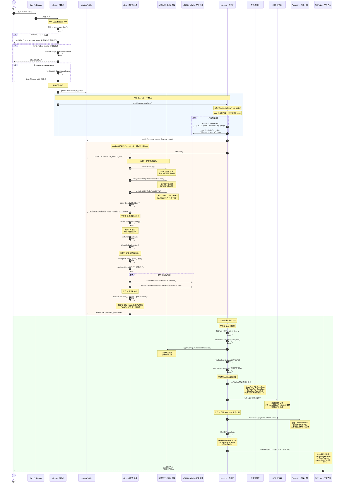
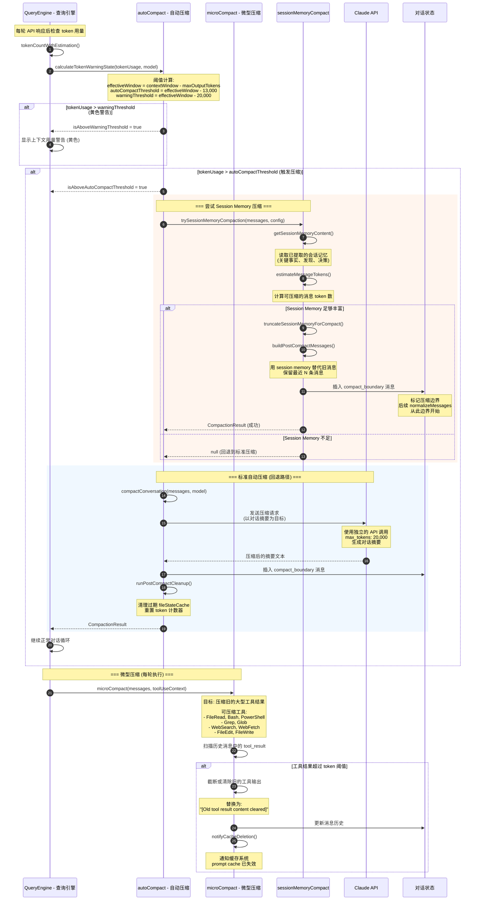

# 阶段 3: 业务工作流分析

## 场景选择

Claude Code CLI 的业务流程围绕两个核心场景展开：

| 编号 | 场景 | 说明 |
|------|------|------|
| 1 | **启动与初始化流程** (Initialization) | 从用户敲下 `claude` 到 REPL 就绪，涵盖配置加载、密钥验证、UI 渲染初始化 |
| 2 | **用户交互对话循环** (Conversation Loop with Tool Use) | 用户输入 → API 调用 → 流式解析 → 工具执行 → 结果反馈的完整闭环，是系统的核心循环 |

选择这两个场景的原因：场景 1 决定了系统的启动性能和配置正确性；场景 2 是用户 99% 时间所处的主循环，其中工具调用与权限检查构成了 Claude Code 区别于普通聊天 CLI 的核心差异点。


## 场景 1: 启动与初始化流程

### 流程概述

启动流程经历了从 Shell → Node.js 入口 → 初始化 → 主程序 → React/Ink 渲染实例的逐级加载过程。设计上刻意将快速路径（如 `--version`）与完整初始化路径分离，实现零延迟响应。

### 详细时序图



### 配置加载优先级（6 层）

启动期间 `enableConfigs()` 按以下优先级合并配置（优先级从高到低）：

```
1. 环境变量覆盖      (CLAUDE_CODE_*)
2. 命令行参数         (--model, --permission-mode ...)
3. 项目级配置         (.claude/settings.json, .claude/settings.local.json)
4. 用户级配置         (~/.claude/settings.json)
5. 企业级 MDM 策略    (macOS: com.anthropic.claude-code, Windows: Registry)
6. 远程托管配置       (Remote Managed Settings)
```

### 启动性能优化要点

| 优化策略 | 实现方式 | 效果 |
|----------|----------|------|
| 零加载快速路径 | `--version` 直接输出，不导入任何模块 | ~0ms 响应 |
| 并行副作用 | MDM 读取、Keychain 预取在 `import` 语句间并行启动 | 节省 ~65ms (macOS) |
| 延迟加载 | OpenTelemetry (~400KB)、gRPC (~700KB) 延迟到实际需要时导入 | 减少初始内存占用 |
| Memoized init | `init()` 使用 `lodash memoize`，保证仅执行一次 | 避免重复初始化 |
| profileCheckpoint | 全链路性能打点，可通过 `--profile` 查看耗时 | 可观测性 |


## 场景 2: 用户交互对话循环（核心循环）

### 流程概述

对话循环是 Claude Code 的核心所在。用户的每一次输入都会经历**消息规范化 → 系统提示词构建 → API 流式调用 → 流式响应解析 → 工具调用/权限检查/执行 → 结果反馈**的完整循环。当 Claude 的响应中包含工具调用时，工具执行结果会被反馈给 API 触发下一轮循环，直到 Claude 返回纯文本（无工具调用）的最终响应。

### 详细时序图



```mermaid
sequenceDiagram
    autonumber
    actor User as 用户
    participant REPL as REPL.tsx - 交互界面
    participant QE as QueryEngine - 查询引擎
    participant Msg as 消息规范化 - messages.ts
    participant Ctx as 上下文构建 - queryContext.ts
    participant API as Claude API - 流式调用
    participant Stream as 流式解析器 - query.ts
    participant STE as StreamingToolExecutor
    participant Perm as 权限系统 - 5种模式
    participant Hooks as 钩子系统 - Hooks
    participant Tool as 工具实例 - BashTool等
    participant Compact as 压缩系统 - Compact

    User->>REPL: 输入文本 + Enter
    Note over REPL: Ink PromptInput 组件<br>收集用户文本

    REPL->>REPL: consumeEarlyInput()<br>(消费预缓冲输入)

    REPL->>QE: processUserInput(text)
    Note over QE: QueryEngine.onUserMessage()

    rect rgb(240, 248, 255)
        Note over QE,Msg: === 阶段 1: 消息预处理 ===

        QE->>QE: processUserInput()<br>解析斜杠命令 / 纯文本
        QE->>QE: createUserMessage(text)

        QE->>Msg: normalizeMessagesForAPI(messages)
        Note over Msg: 1. 移除工具搜索字段<br>2. 过滤不可见消息<br>3. 移除尾部孤立 thinking block

        QE->>Msg: ensureToolResultPairing(messages)
        Note over Msg: 确保每个 tool_use 都有<br>配对的 tool_result<br>修补缺失的 tool_result<br>(合成错误占位符)

        QE->>Msg: stripSignatureBlocks(messages)
        Note over Msg: 清理签名/引用块

        QE->>QE: 检查媒体项数量
        Note over QE: API 限制 > 100 项时<br>stripExcessMediaItems()
    end

    rect rgb(255, 248, 240)
        Note over QE,Ctx: === 阶段 2: 系统提示词构建 ===

        QE->>Ctx: fetchSystemPromptParts(model, tools)

        Ctx->>Ctx: 构建系统提示词层级
        Note over Ctx: 1. CLI 系统前缀<br>   (角色定义、能力描述)<br>2. 工具描述注入<br>   (每个注册工具的 prompt)<br>3. CLAUDE.md 内容注入<br>   (项目级 / 用户级 / 企业级)<br>4. Git 上下文<br>   (仓库、分支、状态)<br>5. 工作目录信息<br>6. 操作系统/Shell 信息

        QE->>QE: prependUserContext()
        Note over QE: 注入用户上下文到消息前端

        QE->>QE: appendSystemContext()
        Note over QE: 追加系统上下文到消息末尾

        QE->>QE: getAttachmentMessages()
        Note over QE: 加载相关 memory 文件<br>filterDuplicateMemoryAttachments()
    end

    rect rgb(240, 255, 240)
        Note over QE,API: === 阶段 3: API 请求发送 ===

        QE->>QE: buildQueryConfig(model)
        Note over QE: 配置项:<br>- max_tokens (动态计算)<br>- thinking 配置<br>- temperature<br>- beta headers

        QE->>API: messages.create({ stream: true })
        Note over API: POST /v1/messages<br><br>请求体包含:<br>- model: 模型标识<br>- system: 系统提示词数组<br>- messages: 对话历史<br>- tools: 工具定义列表<br>- stream: true<br><br>缓存策略:<br>- cache_control: ephemeral (1h)<br>- 系统提示词级别缓存
    end

    rect rgb(248, 240, 255)
        Note over API,Stream: === 阶段 4: 流式响应处理 ===

        loop 逐事件解析 SSE 流
            API-->>Stream: RawMessageStreamEvent

            alt message_start 事件
                Stream->>Stream: 记录 message.id<br>初始化 usage 计数器
            end

            alt content_block_start (type: "text")
                Stream->>REPL: 实时渲染文本输出
                Note over REPL: Ink 增量更新终端
            end

            alt content_block_delta (type: "text_delta")
                Stream->>REPL: 追加文本片段
            end

            alt content_block_start (type: "thinking")
                Stream->>REPL: 渲染思考过程<br>(可折叠展示)
            end

            alt content_block_start (type: "tool_use")
                Stream->>Stream: 检测到工具调用!<br>记录 tool_use block
                Note over Stream: 解析工具名称 + 参数<br>(JSON 增量拼接)
            end

            alt content_block_stop
                Stream->>Stream: 完成当前 block
            end

            alt message_delta (stop_reason)
                Stream->>Stream: 记录停止原因<br>(end_turn / tool_use / max_tokens)
            end

            alt message_stop
                Stream->>Stream: 流结束
            end
        end

        Stream->>QE: 返回完整的 AssistantMessage
        Note over QE: 记录 usage 统计<br>更新 token 计数器
    end

    rect rgb(255, 245, 238)
        Note over QE,Tool: === 阶段 5: 工具调用检测与执行 ===

        QE->>QE: 检查 stop_reason === "tool_use"
        Note over QE: 解析所有 tool_use content blocks

        alt 无工具调用 (stop_reason === "end_turn")
            QE-->>REPL: 返回最终文本响应
            REPL-->>User: 展示完成的回复
        end

        Note over QE: --- 存在工具调用 ---

        QE->>STE: new StreamingToolExecutor(tools, canUseTool)
        Note over STE: 并发控制策略:<br>- 并发安全工具可并行执行<br>- 非并发工具独占执行<br>- 结果按接收顺序缓冲发出

        loop 对每个 tool_use block
            STE->>STE: addTool(block, assistantMessage)

            STE->>Perm: canUseTool(toolName, input)

            Note over Perm: === 权限检查流程 ===
            Note over Perm: 5 种权限模式:<br>1. default - 每次询问用户<br>2. plan - 只读操作自动放行<br>3. autoEdit - 文件编辑自动放行<br>4. fullAuto - 所有操作自动放行<br>5. bypassPermissions - 跳过所有检查

            alt 需要用户确认 (default/plan 模式)
                Perm-->>REPL: 显示权限请求对话框
                REPL-->>User: [Y/n/...] 确认提示
                User->>REPL: 用户决策
                REPL->>Perm: 返回决策结果

                alt 用户拒绝
                    Perm-->>STE: PermissionDenied
                    STE->>QE: 生成拒绝 tool_result
                    Note over QE: "Permission denied"<br>is_error: true
                end
            end

            alt 权限通过
                STE->>Hooks: executePreToolHooks(toolName, input)
                Note over Hooks: onBeforeToolUse 钩子<br>(用户自定义前置逻辑)

                alt 钩子阻止执行
                    Hooks-->>STE: hookCancelled
                    STE->>QE: 生成钩子取消 tool_result
                else 钩子通过
                    Hooks-->>STE: proceed

                    STE->>Tool: tool.execute(input, context)
                    Note over Tool: 工具执行示例:<br><br>BashTool:<br>  spawn shell → 执行命令<br>  → 捕获 stdout/stderr<br><br>FileReadTool:<br>  fs.readFile() → 返回内容<br><br>FileWriteTool:<br>  验证路径 → 写入文件<br>  → 返回 diff<br><br>GrepTool:<br>  执行 ripgrep → 解析结果

                    Tool-->>STE: ToolResult (content)

                    STE->>Hooks: executePostToolHooks(toolName, result)
                    Note over Hooks: onAfterToolUse 钩子<br>(用户自定义后置逻辑)
                end
            end

            STE->>QE: yield MessageUpdate<br>(工具结果消息)
        end
    end

    rect rgb(245, 255, 245)
        Note over QE,API: === 阶段 6: 结果反馈与循环 ===

        QE->>QE: 构建 tool_result 用户消息
        Note over QE: 每个工具结果封装为:<br>{type: "tool_result",<br> tool_use_id: "...",<br> content: "..."}

        QE->>QE: applyToolResultBudget()
        Note over QE: 超大工具输出截断<br>记录内容替换

        QE->>QE: microCompact() 检查
        Note over QE: 对旧的大型工具结果<br>进行微型压缩<br>(清除旧的 FileRead/Bash 输出)

        QE->>QE: 检查自动压缩阈值
        Note over QE: tokenCount > autoCompactThreshold?

        alt 需要自动压缩
            QE->>Compact: autoCompact(messages)
            Note over Compact: 详见下方「上下文压缩」节
        end

        Note over QE: --- 继续对话循环 ---
        QE->>QE: 回到「阶段 1: 消息预处理」
        Note over QE: 将 tool_result 消息追加到历史<br>重新规范化 → 重新调用 API<br>直到 stop_reason !== "tool_use"
    end

    Note over QE,REPL: === 循环终止条件 ===
    Note over QE: stop_reason === "end_turn"<br>或 stop_reason === "max_tokens"<br>或用户中断 (Ctrl+C/Escape)

    QE-->>REPL: 最终响应 + usage 统计
    REPL->>REPL: 渲染最终文本
    REPL->>REPL: 显示 token 用量/成本
    REPL->>REPL: endInteractionSpan()
    REPL-->>User: 显示完成的回复<br>恢复输入等待 >
```

### 工具执行并发模型

`StreamingToolExecutor` 实现了一个精细的并发控制策略：

```
┌──────────────────────────────────────────────────────┐
│              StreamingToolExecutor                     │
│                                                        │
│  工具到达 ──┬── 并发安全? ──是──→ 立即并行执行          │
│             │                                          │
│             └── 否 ──→ 等待所有并行任务完成             │
│                        → 独占执行                      │
│                        → 完成后恢复并行                 │
│                                                        │
│  结果缓冲: 按工具接收顺序发出（非完成顺序）             │
│                                                        │
│  错误处理: Bash 工具错误 → siblingAbortController      │
│            → 立即终止兄弟进程                           │
│                                                        │
│  流式回退: discard() → 丢弃失败尝试的全部结果           │
└──────────────────────────────────────────────────────┘
```

### 消息规范化管线

`normalizeMessagesForAPI()` 是确保 API 调用成功的关键防御层。以下是处理管线中各步骤的作用：

| 步骤 | 函数 | 目的 |
|------|------|------|
| 1 | `getMessagesAfterCompactBoundary()` | 从最近的压缩边界开始，丢弃更早的历史 |
| 2 | `W68()` (filterWhitespaceOnlyAssistant) | 过滤纯空白的 assistant 消息 |
| 3 | `$$Y()` (fixEmptyAssistantContent) | 修补空内容的 assistant 消息（注入占位文本） |
| 4 | `D68()` (filterOrphanedThinking) | 移除没有对应正文的孤立 thinking block |
| 5 | `z$Y()` (filterTrailingThinking) | 移除尾部多余的 thinking/redacted_thinking block |
| 6 | `KZK()` (ensureToolResultPairing) | **核心** - 修补 tool_use / tool_result 配对缺失 |
| 7 | `_ZK()` (stripAdvisorBlocks) | 移除 advisor 相关的内部 block |
| 8 | `hqK()` (stripThinkingForNonThinkingModels) | 对不支持 thinking 的模型移除 thinking block |

### 权限模式对比

```
                    权限级别递增 →
    ┌─────────┬──────────┬───────────┬──────────┬──────────────────┐
    │ default │  plan    │ autoEdit  │ fullAuto │ bypassPermissions│
    ├─────────┼──────────┼───────────┼──────────┼──────────────────┤
    │ 文件读取 │ 自动 ✓   │ 自动 ✓    │ 自动 ✓   │ 自动 ✓            │
    │ Grep    │ 自动 ✓   │ 自动 ✓    │ 自动 ✓   │ 自动 ✓            │
    │ Glob    │ 自动 ✓   │ 自动 ✓    │ 自动 ✓   │ 自动 ✓            │
    │ 文件写入 │ 询问用户 │ 询问用户  │ 自动 ✓   │ 自动 ✓            │
    │ 文件编辑 │ 询问用户 │ 询问用户  │ 自动 ✓   │ 自动 ✓            │
    │ Bash    │ 询问用户 │ 询问用户  │ 询问用户 │ 自动 ✓            │
    │ 危险操作 │ 询问用户 │ 询问用户  │ 询问用户 │ 自动 ✓            │
    └─────────┴──────────┴───────────┴──────────┴──────────────────┘
```


## 上下文压缩子系统

当对话累积的 token 数量接近模型的上下文窗口限制时，压缩系统自动介入，防止 `prompt_too_long` 错误。

### 压缩时序图



### 压缩策略对比

| 维度 | microCompact | autoCompact | sessionMemoryCompact |
|------|-------------|-------------|---------------------|
| **触发时机** | 每轮对话后 | token 超过阈值 | autoCompact 的优先路径 |
| **压缩目标** | 单个旧工具结果 | 整段对话历史 | 基于提取的会话记忆 |
| **API 调用** | 无 (本地操作) | 需要 (生成摘要) | 无 (使用已有记忆) |
| **压缩粒度** | 工具级 | 对话级 | 对话级 |
| **信息损失** | 中 (工具输出) | 高 (全部旧消息) | 低 (保留关键记忆) |
| **性能开销** | 极低 | 较高 (~1次API) | 低 |
| **阈值** | 基于时间/token | contextWindow - 13K | 优先于标准压缩 |
| **连续失败保护** | 无 | MAX=3次后停止重试 | 不足时回退 |


## 关键数据流总结

```
用户输入
  │
  ▼
┌─────────────────┐     ┌──────────────────┐     ┌──────────────────┐
│ 消息规范化       │ ──→ │ 系统提示词构建     │ ──→ │ API 请求组装      │
│                 │     │                  │     │                  │
│ • normalize     │     │ • CLI prefix     │     │ • model          │
│ • ensurePairing │     │ • CLAUDE.md      │     │ • system[]       │
│ • stripBlocks   │     │ • Git context    │     │ • messages[]     │
│ • media limit   │     │ • tools prompt   │     │ • tools[]        │
└─────────────────┘     └──────────────────┘     │ • stream: true   │
                                                  └────────┬─────────┘
                                                           │
                                                           ▼
┌─────────────────┐     ┌──────────────────┐     ┌──────────────────┐
│ 上下文压缩       │ ←── │ 工具执行反馈      │ ←── │ 流式响应解析      │
│                 │     │                  │     │                  │
│ • microCompact  │     │ • permission     │     │ • SSE parsing    │
│ • autoCompact   │     │ • hooks          │     │ • text render    │
│ • sessionMemory │     │ • tool.execute() │     │ • tool_use detect│
│                 │     │ • tool_result    │     │ • usage tracking │
└────────┬────────┘     └──────────────────┘     └──────────────────┘
         │
         │ 如果 stop_reason === "tool_use"
         └──────────────→ 回到消息规范化 (循环)
         
         如果 stop_reason === "end_turn"
         └──────────────→ 展示最终响应给用户
```


## 错误处理与恢复

对话循环中的错误处理覆盖了多个层次：

| 错误类型 | 处理策略 | 源码位置 |
|----------|----------|----------|
| API 速率限制 (429) | 指数退避重试，显示倒计时 | `services/api/withRetry.ts` |
| 上下文过长 (prompt_too_long) | 触发自动压缩后重试 | `query.ts` |
| 工具执行失败 | 生成 `is_error: true` 的 tool_result，让模型自行调整 | `StreamingToolExecutor.ts` |
| 流式连接中断 | FallbackTriggeredError → 重试 | `services/api/withRetry.ts` |
| 用户中断 (Ctrl+C) | AbortController 信号传播，终止当前请求 | `query.ts` |
| 钩子执行错误 | 记录错误但不阻止主流程（除非 preventContinuation） | `utils/hooks.ts` |
| 连续压缩失败 | 3 次后停止重试，防止无限循环 | `autoCompact.ts` |
| tool_use/tool_result 不配对 | 合成错误占位符修补，记录诊断日志 | `messages.ts` |
